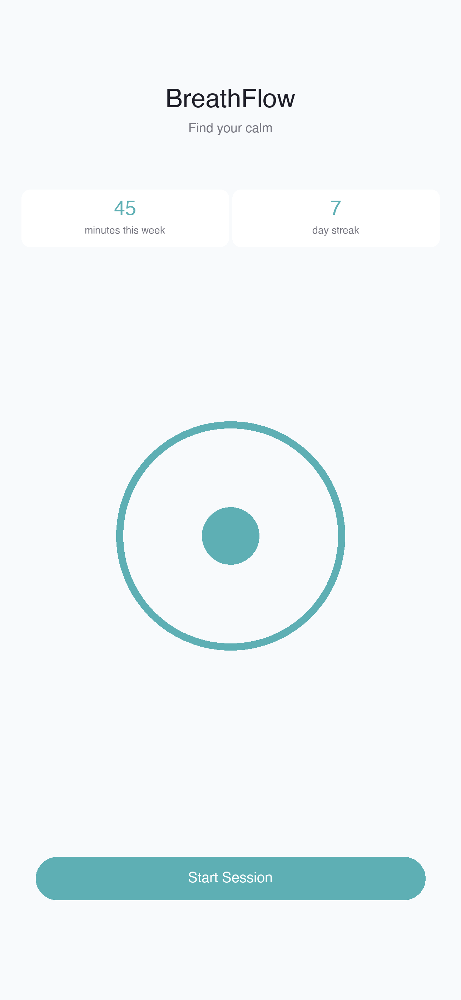
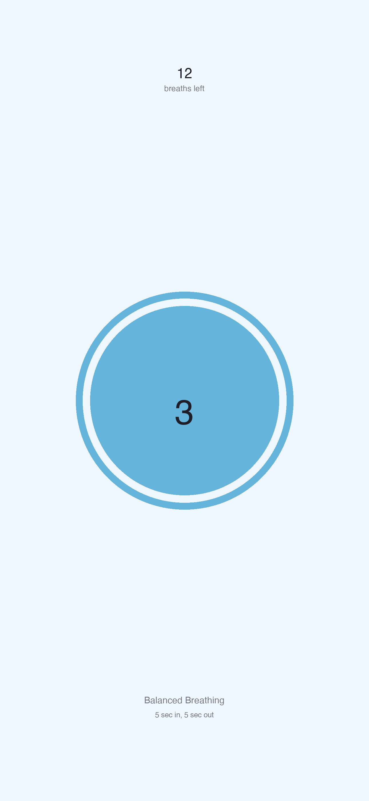
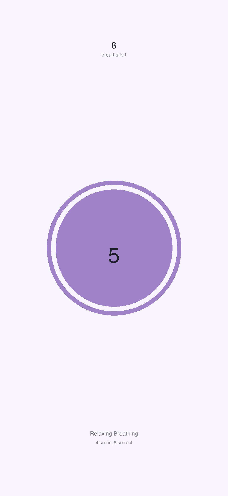
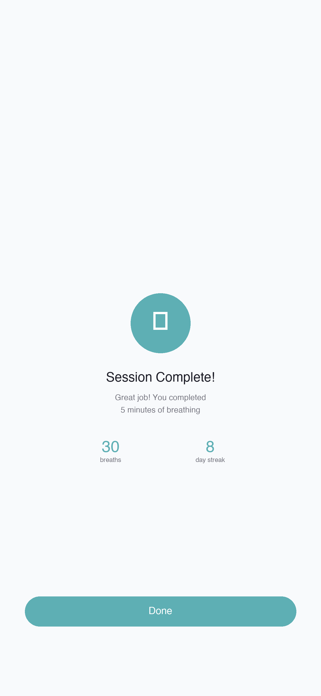

# BreathFlow

A minimalist iOS breathwork application built with SwiftUI. Guide your breathing with animated visuals and audio cues to help reduce stress, improve focus, and promote relaxation.

## Features

- **Two Breathing Exercises**
  - **Balanced (5-5)**: Equal inhale and exhale for focus and calm
  - **Relaxing (4-8)**: Extended exhale for deep relaxation

- **Session Durations**: 5, 10, 15, or 20 minutes

- **Visual Guidance**: Animated ring that fills during inhale and empties during exhale

- **Audio Feedback**: Soft tones on breath phase transitions with mute option

- **Progress Tracking**
  - Total breathing time tracked
  - Daily streak for consecutive practice days

- **Background Support**: Continue sessions with the app in background

## Screenshots

| Home | Inhale | Exhale | Complete |
|------|--------|--------|----------|
|  |  |  |  |

## Requirements

- iOS 16.2+
- Xcode 15+

## Building

This project uses [XcodeGen](https://github.com/yonaskolb/XcodeGen) to generate the Xcode project.

```bash
# Install XcodeGen if needed
brew install xcodegen

# Generate the Xcode project
cd BreathFlow
xcodegen generate

# Open in Xcode
open BreathFlow.xcodeproj
```

## Project Structure

```
BreathFlow/
├── BreathFlowApp.swift          # App entry point
├── Models/
│   ├── BreathingExercise.swift  # Exercise types & durations
│   └── UserStats.swift          # Stats model
├── Views/
│   ├── HomeView.swift           # Main screen with stats
│   ├── ExercisePickerView.swift # Exercise selection
│   ├── BreathingSessionView.swift # Active breathing session
│   └── CompletionView.swift     # Session complete screen
├── Components/
│   ├── BreathingCircle.swift    # Animated breathing ring
│   └── StatCard.swift           # Stats display card
├── Services/
│   ├── StatsManager.swift       # Persist stats to UserDefaults
│   └── AudioManager.swift       # Audio playback
├── Extensions/
│   └── Color+Theme.swift        # App color theme
└── Resources/
    ├── inhale.mp3               # Inhale sound
    └── exhale.mp3               # Exhale sound
```

## How It Works

1. Select a breathing exercise (Balanced or Relaxing)
2. Choose your session duration
3. A 3-second countdown prepares you
4. Follow the animated ring: expand on inhale, contract on exhale
5. Audio cues play at each phase transition
6. Track your progress with streaks and total time

## Tech Stack

- **SwiftUI** for UI
- **AVFoundation** for audio playback
- **UserDefaults** for local persistence

## License

MIT
